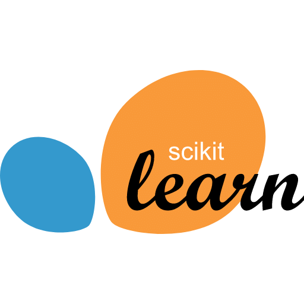
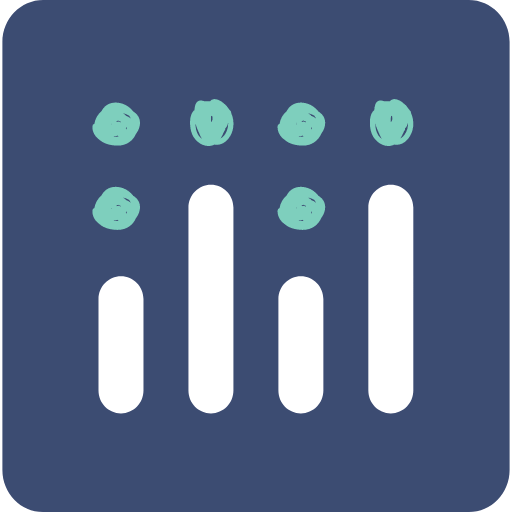
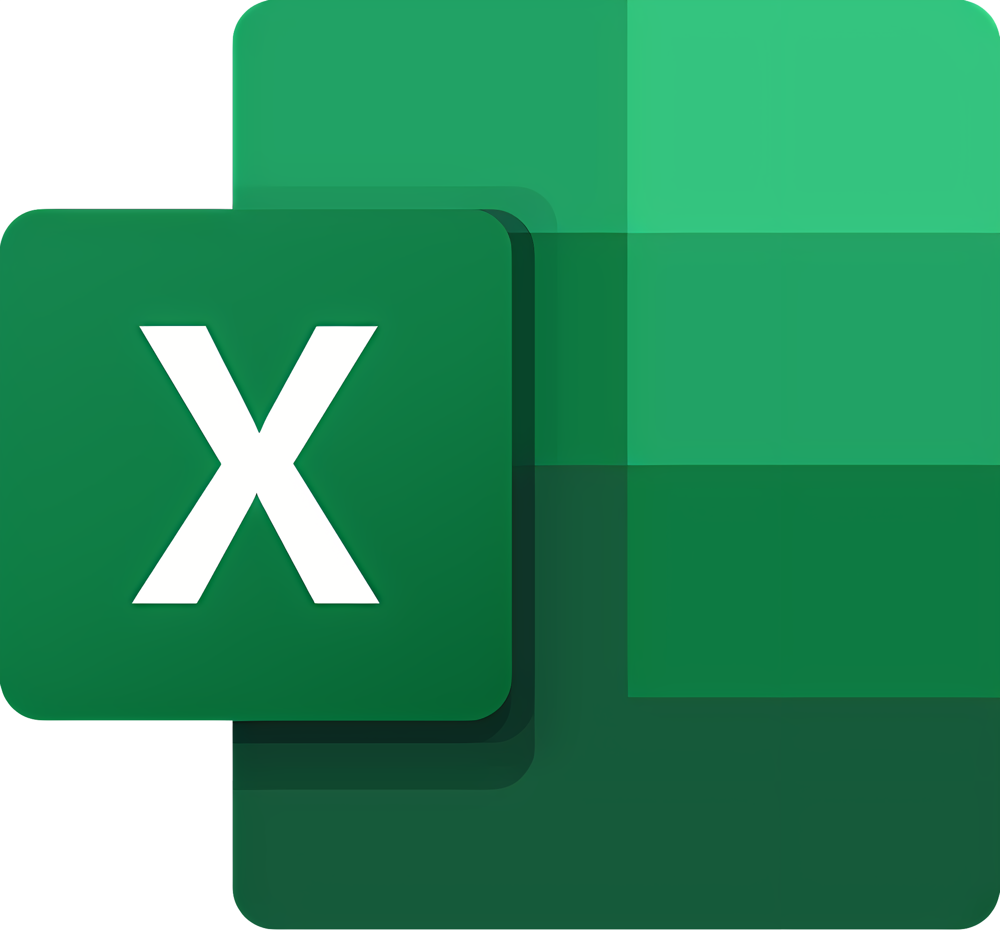

<h1 align="center">Meer Mehran Khan</h1>
<h3 align="center">Data Analyst · Python Developer</h3>

I take messy datasets and turn them into something people can actually use, a dashboard, a model, or just a CSV that finally makes sense. Most of what I build lives here, because I'd rather show the work than talk about it.

  
  
  
  

  
  

---

### 🧑‍💻 About Me

BS Information Technology graduate (Quaid-e-Awam University of Engineering, Science & Technology, CGPA 3.21) focused on data analysis, automation, and building tools that solve real problems. Most of my work starts with a messy dataset or an inefficient process and ends with something shipped.

I work mainly in Python, using Pandas, SQL, and Streamlit to build end-to-end pipelines, analytical dashboards, and ML-driven applications. Every project below represents a problem I identified, scoped, and built on my own, spanning NLP-based text analysis, finance automation, pricing intelligence, and agentic AI. Currently looking for full-time Data Analyst / Junior Data Scientist roles where I can work with real business data.

---

### 💼 Experience

**Data Analysis Intern — Qwetrum Technologies** · Remote · Jun 2026 – Jul 2026

- Ran exploratory data analysis on a 9,994-row, 21-column retail dataset, surfacing top-selling products, month-over-month revenue trends, and profitability by category and region
- Cleaned and validated the Census Income dataset: handled missing values, stripped whitespace, removed 24 duplicate rows, and corrected data types
- Built Matplotlib/Seaborn visualizations (bar, line, pie/donut) to communicate sales distribution and discount-vs-profit effects
- Documented a reproducible Python/Pandas workflow in Jupyter Notebooks with before-and-after data quality comparisons

---

### 🧰 Tech Stack

**Languages & Databases**

**Data Science & Analytics**

**Visualization & BI**

**Machine Learning & AI**

**Tools & Platforms**

<!--  -->

<!--  -->

---

### 🚀 Featured Projects

**[AI News Intelligence Dashboard](https://github.com/MeerMehranKhan/ai-news-intelligence-dashboard)**
Ingests up to 200 articles per run from 25+ RSS sources (Reuters, BBC, NYT, TechCrunch, Al Jazeera), classifies content into 13 topic clusters with TF-IDF cosine similarity, scores sentiment with VADER, and maps signals across 28 countries. Deployed as a Streamlit dashboard.
`Python` `Streamlit` `Scikit-learn` `Plotly` `NLP`

**[Smart Expense Analyzer](https://github.com/MeerMehranKhan/smart-expense-analyzer)**
Personal finance dashboard that auto-categorizes transactions with regex heuristics, flags anomalies with IQR-based outlier detection, forecasts next-month spend with moving averages, and exports reports in PDF, CSV, and JSON.
`Python` `Streamlit` `Pandas` `Plotly` `SQLite`

**[AI Pricing Intelligence Engine](https://github.com/MeerMehranKhan/ai-pricing-intelligence-engine)**
Simulates P&L across 50 price points, clusters competitor pricing, and runs sensitivity analysis to stress-test assumptions, producing 90-day revenue projections and go/no-go pricing decisions.
`Python` `Streamlit` `Scikit-learn` `Plotly` `Pydantic`

**[AI-Powered Resume Analyzer](https://github.com/MeerMehranKhan/ai-powered-resume-analyzer)**
Local-first tool that parses PDF resumes, compares them against job descriptions via TF-IDF, and surfaces ATS keyword gaps with a scored match report (~85% accuracy on test cases) plus section-level rewrite coaching. Runs fully offline.
`Python` `Streamlit` `PyMuPDF` `Scikit-learn`

**[AI Product Research Agent](https://github.com/MeerMehranKhan/ai-product-research-agent)**
Evaluates 200+ e-commerce candidates with multi-factor weighted scoring, confidence levels, and risk indicators, then generates launch plans with full unit economics.
`Python` `Streamlit` `FastAPI` `SQLite` `BeautifulSoup`

**[AI-Powered Startup Idea Validator](https://github.com/MeerMehranKhan/ai-powered-startup-idea-validator)**
Turns a single idea input into a full business analysis: SWOT breakdown, MVP scope, competitor mapping, and multi-factor risk scoring, with interactive radar charts and SQLite-backed session history.
`Python` `Streamlit` `Plotly` `Pydantic` `SQLite`

📁 Full write-ups and screenshots on my **[portfolio](https://portfolio-meer-mehran-khan.vercel.app/)**.

---

### 📜 Certifications

- **Google Advanced Data Analytics Professional Certificate** — Google via Coursera · [Verify](https://coursera.org/verify/professional-cert/GIF98L3Y1UDM)
- **Google Business Intelligence Professional Certificate** — Google via Coursera · [Verify](https://coursera.org/verify/professional-cert/SMWO200NIW03)
- **IBM RAG and Agentic AI Professional Certificate** — IBM via Coursera · [Verify](https://coursera.org/verify/professional-cert/R64S7UZOH6GW)

---

### 📊 GitHub Stats

  
  

  

---

  📫 Reach me at <b>imeermehrankhan@gmail.com</b> — open to Data Analyst / Data Science roles and freelance work.

